# Intent-to-Execution-Agent 产品方案说明书

> 项目二：从模糊目标出发，帮助用户持续完成复杂任务的 Agent user flow / 产品化 Demo

## 1. 一句话概述

Intent-to-Execution-Agent 是一个面向复杂任务的 Agent 产品化 Demo：用户只需输入一个模糊目标，Agent 通过渐进式澄清、动态规划、阶段执行、用户验收、失败恢复和持续迭代，帮助用户把开放目标推进为可交付成果。

本 Demo 以“电商自动化运营 Agent”为贯穿案例，但核心设计不依赖电商场景，可迁移到市场研究、软件开发、活动策划、数据分析等长周期任务。

## 2. 问题理解

传统 ChatBot 更擅长回答单次问题，而复杂任务需要持续推进：

| 对比维度 | 传统 ChatBot | Complex Task Agent |
|---|---|---|
| 目标 | 回答当前问题 | 完成长期任务 |
| 状态 | 依赖聊天上下文 | 维护结构化任务状态 |
| 执行 | 生成内容为主 | 规划、执行、验收、恢复 |
| 用户角色 | 提问者 | 决策者与协作者 |
| 完成标准 | 输出答案 | 用户验收可用成果 |

复杂任务的关键矛盾是：用户目标往往模糊，但执行必须具体；Agent 可以自动推进，但不能越权；任务可能局部失败，但不能整体停摆。因此，本方案的核心不是“让 Agent 更会聊天”，而是设计一套可控、可恢复、可验收的任务协作流程。

## 3. 核心设计取舍

### 为什么采用渐进式澄清

复杂任务一开始通常缺少平台、范围、目标、预算、权限和验收标准。如果要求用户先填写完整问卷，会增加启动成本，也容易让用户在不了解方案前被迫做过多决策。渐进式澄清只询问会改变执行方案的关键问题，让 Agent 先建立足够可用的目标版本，再在执行中继续补齐上下文。

### 为什么采用阶段确认

Agent 不应该从模糊目标直接进入完全自动执行。复杂任务涉及账号、数据、预算、对外发布和业务风险，越靠近真实执行，越需要用户确认。阶段确认把用户决策放在目标结构化、计划确认、阶段验收和最终交付等关键节点，既保留自动化效率，也避免黑盒执行带来的信任风险。

### 为什么需要 Human Handoff

复杂任务中的很多判断不是模型能力问题，而是业务责任问题。高风险决策、权限审批、策略取舍、异常状态判断，都需要人类承担最终责任。Human Handoff 让 Agent 在需要人类判断时主动交出控制权，同时保留上下文、进度和建议，避免用户从零接手。

### 为什么需要长期状态

复杂任务可能跨天、跨阶段、跨工具完成，不能依赖短暂聊天上下文。Agent 需要保存目标、计划、进度、工具结果、风险状态和检查点。这样用户第二天回来时，任务可以从最近一致状态继续；发生失败时，也能恢复、回滚或局部重规划。

### 为什么采用局部恢复

复杂任务中单个 API、数据源或子任务失败很常见。如果任何局部失败都导致整体任务失败，Agent 就无法承担真实工作流。局部恢复的设计目标是隔离影响、保留成果、切换路径，并把不可自动处理的部分交给用户或人工接管，让任务尽可能继续向前推进。

## 4. Agent User Flow

Agent 不是固定步骤播放器，而是根据目标完整度、权限状态、风险等级、任务进度和用户反馈决定下一步动作。

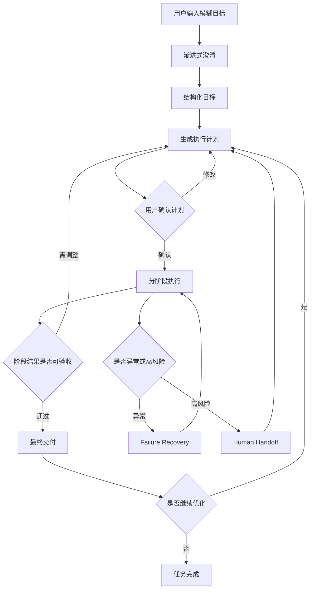

### 阶段逻辑

- **目标输入**：用户只需要说出想完成什么，Agent 识别任务类型和缺失信息。
- **需求澄清**：Agent 只追问影响计划的关键决策，如平台、目标、自动化边界。
- **计划确认**：Agent 将目标拆成可执行计划，用户确认范围和风险边界。
- **执行监控**：Agent 推进任务、记录事件、展示进度，并保存检查点。
- **阶段验收**：用户确认阶段成果是否可进入下一步。
- **最终交付**：Agent 汇总结构化目标、计划、结果、风险和下一轮建议。
- **持续迭代**：用户反馈会触发重规划，而不是从头开始。

## 5. 核心界面状态

产品界面围绕“用户控制、任务推进、上下文与交付”三类信息组织。目标是让用户随时知道：Agent 正在做什么、为什么等待我、哪里有风险、最终会交付什么。

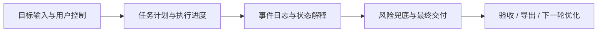

关键状态包括：

- **Waiting**：Agent 等待用户确认目标、计划或关键决策。
- **Running**：Agent 正在推进低风险或已授权任务。
- **Review**：阶段结果已生成，需要用户验收。
- **Paused**：任务被用户暂停，检查点保留。
- **Human Handoff**：Agent 交出控制权，等待人工处理。
- **Delivered**：最终结果可导出，也可进入下一轮优化。

## 6. 用户确认机制

确认机制不是为了打断用户，而是为了平衡自动化效率、用户控制权和风险管理。

| 确认类型 | 适用场景 | 产品目的 |
|---|---|---|
| 弱确认 | 分析、草稿、总结、低风险建议 | 减少打断，保持推进效率 |
| 阶段确认 | 目标结构化、计划生成、阶段结果 | 确保方向正确，避免长期偏航 |
| 强确认 | 权限、预算、发布、改价、删除、对外触达 | 防止越权和不可逆风险 |

确认原则：

- 用户沉默不等于授权。
- 推荐值不等于确认。
- 高风险动作必须限定对象、范围、金额、期限和版本。
- 用户可以随时暂停、降级权限或人工接管。

## 7. Human Handoff

Human Handoff 是主流程能力，不只是错误兜底。Agent 与用户的关系不是替代，而是协作：Agent 负责推进和整理，人类负责关键判断和责任决策。

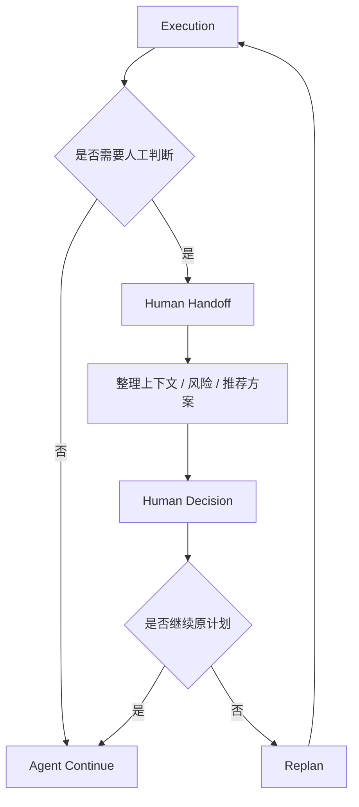

人工接管场景包括：高风险决策、权限审批、策略取舍、多方案冲突、工具状态不明、用户主动介入。接管时，Agent 应交付当前目标、计划进度、已执行动作、风险原因、待决策项和推荐方案，让用户低成本介入。

## 8. Failure Recovery

复杂任务中失败不可避免，产品设计的关键是让失败可解释、可隔离、可恢复。

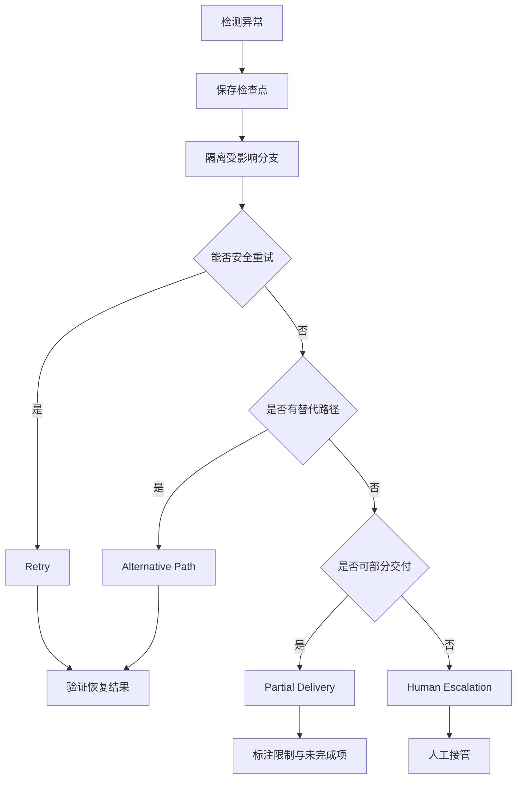

四类恢复策略：

- **Retry**：适用于临时失败，且动作具备幂等保障。
- **Alternative Path**：原工具不可用时，切换 CSV、样例数据或人工输入。
- **Partial Delivery**：保留已完成结果，明确未完成项和风险。
- **Human Escalation**：当状态不明或风险过高时，交给人工判断。

核心原则：局部失败不应该导致任务失败。Agent 要尽可能保留成果、缩小影响、继续推进。

## 9. 系统架构

系统架构围绕“输入、规划、执行、状态、记忆、工具”六个环节展开。Demo 侧重产品体验，但落地时需要明确 Agent 编排层与状态管理层的职责。

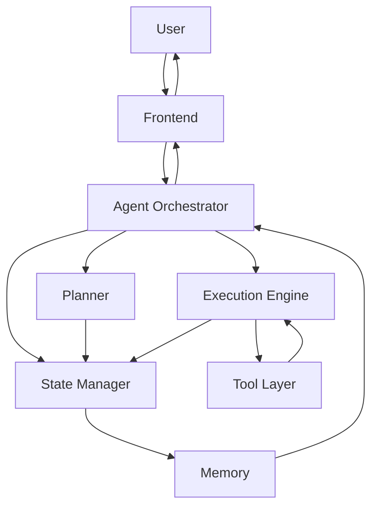

模块说明：

- **Frontend**：承载目标输入、计划确认、进度监控、人工接管和结果验收。
- **Agent Orchestrator**：决定下一步是澄清、规划、执行、等待确认还是恢复。
- **Planner**：将目标拆解为任务、依赖、里程碑和验收标准。
- **State Manager**：维护目标、计划、进度、风险、权限和检查点。
- **Memory**：保存长期上下文、用户决策、工具结果和历史版本。
- **Execution Engine**：执行已授权任务，并在执行后验证结果。
- **Tool Layer**：连接外部数据源、业务系统、文件和自动化工具。

## 10. Demo 展示

### 10.1 目标输入

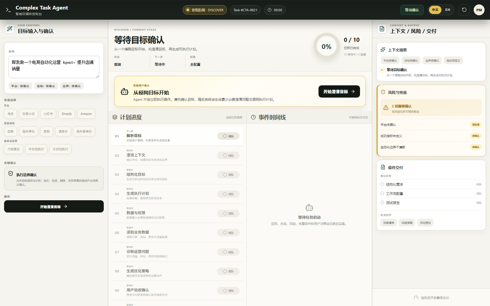

展示重点：用户可以用自然语言输入模糊目标；Agent 明确提示不会立即执行，而是先进入目标澄清和计划生成。

### 10.2 需求澄清

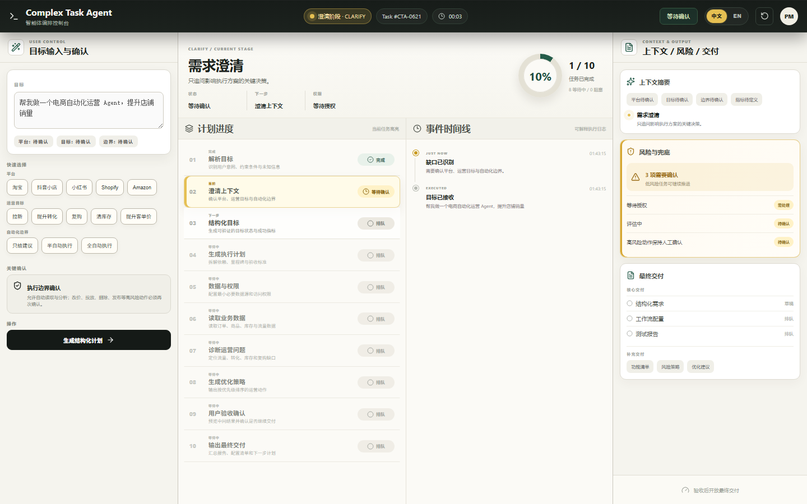

展示重点：Agent 将开放目标转成关键选择项，例如平台、运营目标、自动化边界。澄清问题少而关键，不使用长问卷。

### 10.3 计划确认

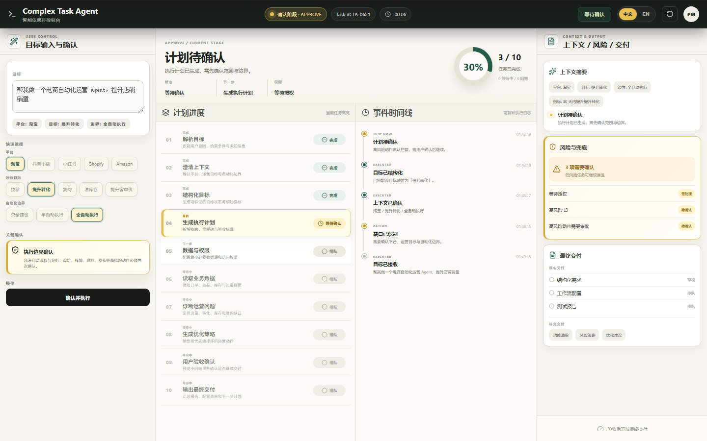

展示重点：目标被拆解为可执行计划，用户在执行前确认边界。任务进度、事件日志、风险提示和交付状态同时可见。

### 10.4 执行监控

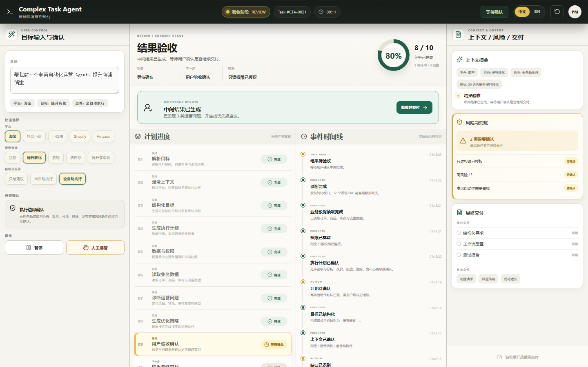

展示重点：Agent 执行过程中持续更新任务状态和事件日志，并在阶段结果生成后要求用户验收。

### 10.5 人工接管

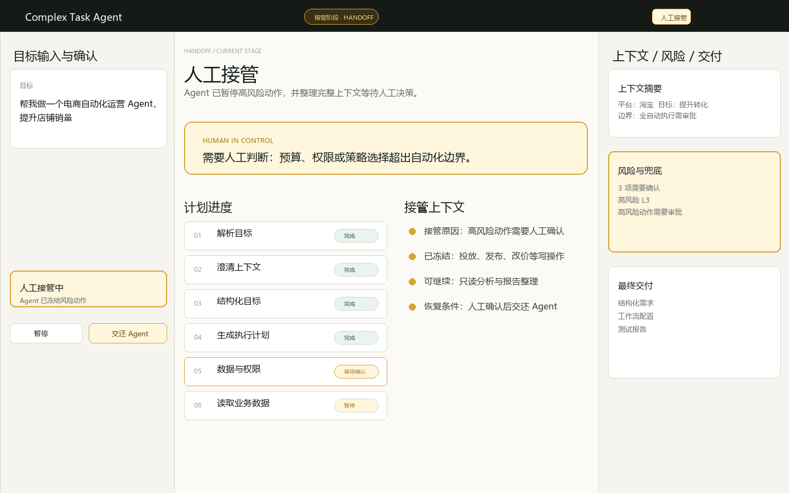

展示重点：当出现高风险决策、权限审批或策略取舍时，Agent 应暂停相关动作，整理上下文，并将控制权交给用户。当前仓库未单独沉淀该状态截图，此处保留提交规范占位。

### 10.6 最终交付

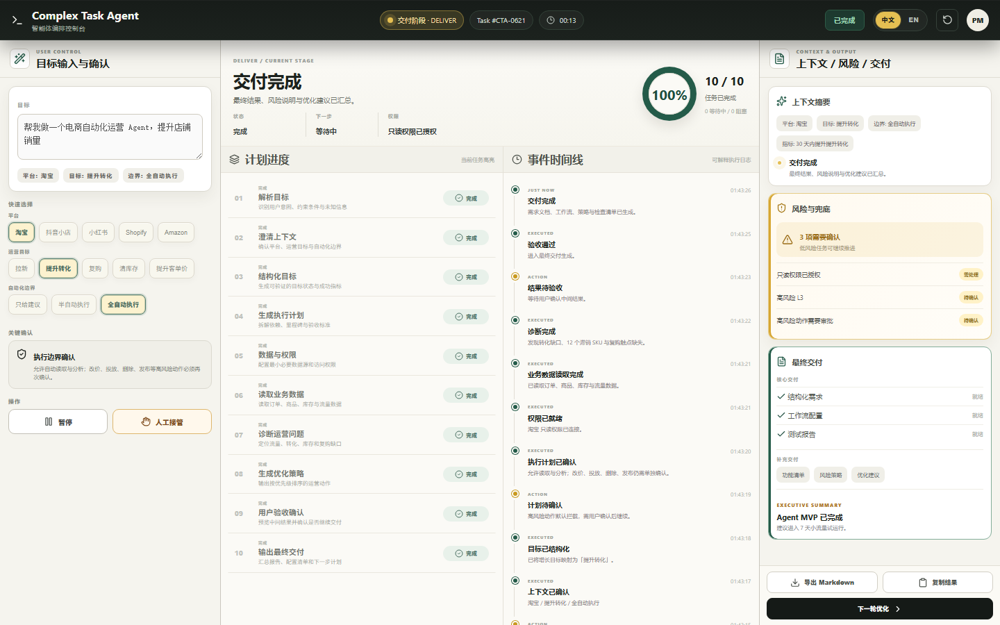

展示重点：Agent 汇总最终成果、风险说明和下一步建议，用户可以导出结果，也可以进入下一轮优化。

## 11. Agent Deliverables

最终交付不是一份静态文档，而是一组可继续运行的任务成果：

- **Structured Goal**：结构化目标、范围、指标和约束。
- **Execution Plan**：任务拆解、依赖关系、里程碑和验收条件。
- **Workflow Configuration**：自动化边界、权限、触发条件和审批规则。
- **Generated Assets**：策略建议、草稿、报告和行动清单。
- **Decision Logs**：用户确认、Agent 建议、风险判断和关键取舍。
- **Evaluation Report**：完成度、失败项、限制和验证结果。
- **Optimization Roadmap**：下一轮优化建议和持续运营计划。

## 12. 设计亮点

- **从模糊目标到结构化目标**  
  降低用户启动成本，同时让后续执行有明确边界和成功标准。

- **动态任务规划**  
  任务不是一次性列表，而是会根据用户反馈、异常和阶段结果持续调整。

- **分级确认机制**  
  低风险任务保持效率，高风险动作保留用户控制权。

- **Human Handoff**  
  把人类判断纳入主流程，让 Agent 在高不确定场景下更可靠。

- **长期任务状态管理**  
  保存目标、计划、进度、风险和检查点，支持跨天继续、恢复和重规划。

- **Failure Recovery**  
  通过重试、替代路径、部分交付和人工升级，避免局部失败拖垮整体任务。

- **持续运营闭环**  
  最终交付不是终点，用户反馈可以进入下一轮计划和执行。

## 13. 总结

Complex Task Agent 的核心价值，是把 Agent 从“一次性回答工具”升级为“复杂任务协作者”。它不追求无边界自动化，而是通过渐进式澄清、阶段确认、长期状态、人工接管和失败恢复，让用户可以放心把一个模糊目标交给 Agent 持续推进，直到形成可验收、可复盘、可继续运行的成果。
